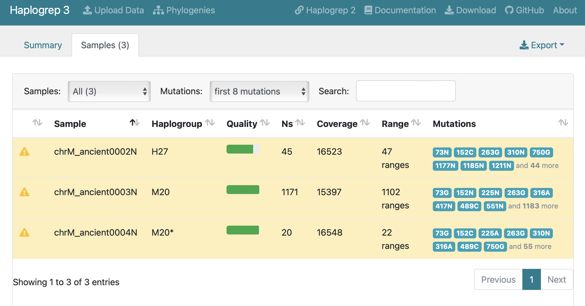
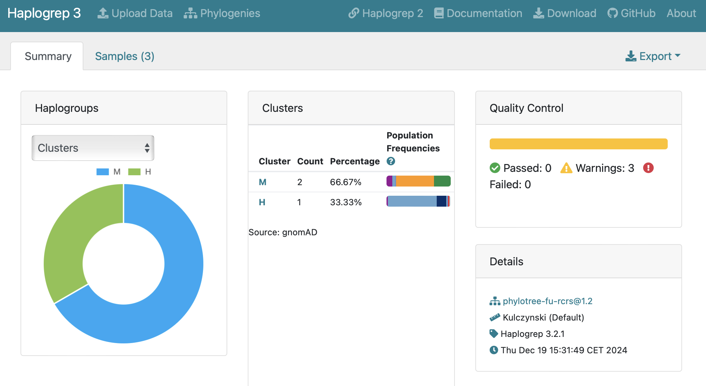
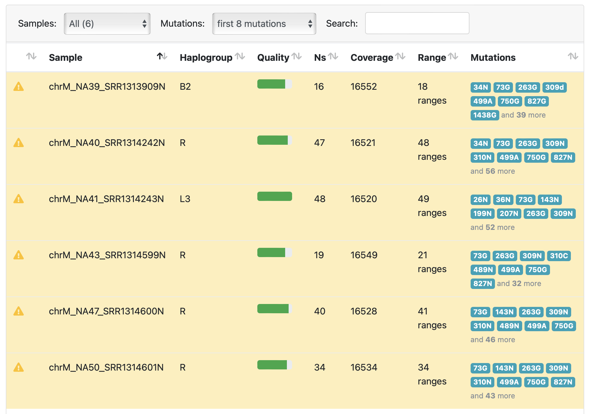
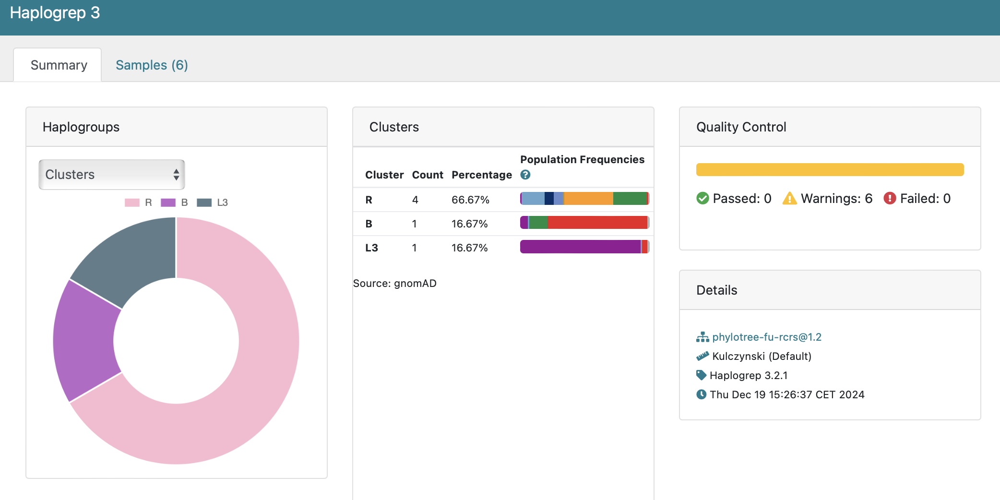

# Ancient DNA Analysis

## PCA Visualization
- [Interactive PCA Visualization](pca_visualization.html) - 3D visualization of PCA results for both Chachapoya and Nazca samples

## Nazca Analysis

### nf-core/eager Reports
- [hg38 momia1, momia3, momia5, momia6 nf-core/eager MultiQC Report](eager_hg38_ipn_eager_multiqc/multiqc_report.html#damageprofiler)
- [hg38 ancient0002, ancient0003, ancient0004 nf-core/eager MultiQC Report](eager_hg38_a234_eager_multiqc/multiqc_report.html#damageprofiler)

## Chachapoya Analysis

### Sample Information
- Sample NA50 was obtained from a dataset of pre-Columbian Chachapoyan and Chachapoya-Inca remains dating between 1000 and 1500 AD
- Location: Laguna de los Condores, northeastern Peru
- Material: Bone samples

### Sequence Data
- [Precapture NA50](https://trace.ncbi.nlm.nih.gov/Traces/?view=run_browser&acc=SRR1298755&display=metadata)
- [Postcapture NA50](https://trace.ncbi.nlm.nih.gov/Traces/?view=run_browser&acc=SRR1314601&display=metadata)

### nf-core/eager Reports
- [Precapture NA50 nf-core/eager MultiQC Report](eager_chachapoya_precapture_eager_multiqc/multiqc_report.html#damageprofiler) - Damage patterns for precapture data
- [Postcapture NA39-50 nf-core/eager MultiQC Report](eager_chachapoya_postcapture_eager_multiqc/multiqc_report.html#damageprofiler) - Damage patterns for postcapture data

## Mitochondrial DNA Analysis (rCRS)

### nf-core/eager Reports
- [hg38 momia1, momia3, momia5, momia6 nf-core/eager MultiQC Report](eager_hg38_ipn_eager_multiqc/multiqc_report.html#damageprofiler)
- [hg38 ancient0002, ancient0003, ancient0004 nf-core/eager MultiQC Report](eager_hg38_a234_eager_multiqc/multiqc_report.html#damageprofiler)

### Nazca Samples Analysis

| Sample | SRA Accession | Consensus Sequence | Haplogroup |
|--------|---------------|-------------------|------------|
| ancient0002 | [SRR21031366](https://trace.ncbi.nlm.nih.gov/Traces/?view=run_browser&acc=SRR21031366) | [Download FASTA](haplogrep3_rCRS_nazca/ancient0002.fasta.gz) | H27 |
| ancient0003 | [SRR20755928](https://trace.ncbi.nlm.nih.gov/Traces/?view=run_browser&acc=SRR20755928) | [Download FASTA](haplogrep3_rCRS_nazca/ancient0003.fasta.gz) | M20 |
| ancient0004 | [SRR20458000](https://trace.ncbi.nlm.nih.gov/Traces/?view=run_browser&acc=SRR20458000) | [Download FASTA](haplogrep3_rCRS_nazca/ancient0004.fasta.gz) | M20* |

| Haplogroup Results | Quality Summary |
|-------------------|-----------------|
|  |  |

### Chachapoya Samples Analysis

| Sample | SRA Accession | Consensus Sequence | Haplogroup |
|--------|---------------|-------------------|------------|
| NA39 | [SRR1313909](https://trace.ncbi.nlm.nih.gov/Traces/?view=run_browser&acc=SRR1313909) | [Download FASTA](haplogrep3_rCRS_chachapoya/NA39_SRR1313909.fasta.gz) | B2 |
| NA40 | [SRR1314212](https://trace.ncbi.nlm.nih.gov/Traces/?view=run_browser&acc=SRR1314212) | [Download FASTA](haplogrep3_rCRS_chachapoya/NA40_SRR1314212.fasta.gz) | R |
| NA41 | [SRR1314213](https://trace.ncbi.nlm.nih.gov/Traces/?view=run_browser&acc=SRR1314213) | [Download FASTA](haplogrep3_rCRS_chachapoya/NA41_SRR1314213.fasta.gz) | L3 |
| NA43 | [SRR1314599](https://trace.ncbi.nlm.nih.gov/Traces/?view=run_browser&acc=SRR1314599) | [Download FASTA](haplogrep3_rCRS_chachapoya/NA43_SRR1314599.fasta.gz) | R |
| NA47 | [SRR1314600](https://trace.ncbi.nlm.nih.gov/Traces/?view=run_browser&acc=SRR1314600) | [Download FASTA](haplogrep3_rCRS_chachapoya/NA47_SRR1314600.fasta.gz) | R |
| NA50 | [SRR1314601](https://trace.ncbi.nlm.nih.gov/Traces/?view=run_browser&acc=SRR1314601) | [Download FASTA](haplogrep3_rCRS_chachapoya/NA50_SRR1314601.fasta.gz) | R |

| Haplogroup Results | Quality Summary |
|-------------------|-----------------|
|  |  |

### Detailed Results and Analysis Files
- [View Haplogroup Analysis Report (Nazca)](haplogrep3_rCRS_nazca/nazca-haplogrep3/haplogroups.html)
- [Download Complete Analysis Files (Nazca)](haplogrep3_rCRS_nazca/nazca-haplogrep3.zip)
- [View Haplogroup Analysis Report (Chachapoya)](haplogrep3_rCRS_chachapoya/chachapoya-haplogrep3/haplogroups.html)
- [Download Complete Analysis Files (Chachapoya)](haplogrep3_rCRS_chachapoya/chachapoya-haplogrep3.zip)
