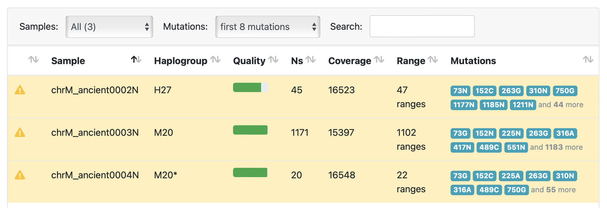
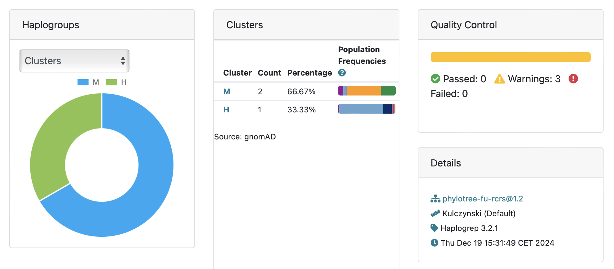

# Ancient DNA Analysis

## PCA Visualization
- [Interactive PCA Visualization](pca_visualization.html) - 3D visualization of PCA results for both Chachapoya and Nazca samples

## Nazca Analysis

### nf-core/eager Reports
- [hg38 momia1, momia3, momia5, momia6 nf-core/eager MultiQC Report](eager_hg38_ipn_eager_multiqc/multiqc_report.html#damageprofiler)
- [hg38 ancient0002, ancient0003, ancient0004 nf-core/eager MultiQC Report](eager_hg38_a234_eager_multiqc/multiqc_report.html#damageprofiler)

## Chachapoya Analysis

### Sample Information
- Sample NA50 was obtained from a dataset of pre-Columbian Chachapoyan and Chachapoya-Inca remains dating between 1000 and 1500 AD
- Location: Laguna de los Condores, northeastern Peru
- Material: Bone samples

### Sequence Data
- [Precapture NA50](https://trace.ncbi.nlm.nih.gov/Traces/?view=run_browser&acc=SRR1298755&display=metadata)
- [Postcapture NA50](https://trace.ncbi.nlm.nih.gov/Traces/?view=run_browser&acc=SRR1314601&display=metadata)

### nf-core/eager Reports
- [Precapture NA50 nf-core/eager MultiQC Report](eager_chachapoya_precapture_eager_multiqc/multiqc_report.html#damageprofiler) - Damage patterns for precapture data
- [Postcapture NA39-50 nf-core/eager MultiQC Report](eager_chachapoya_postcapture_eager_multiqc/multiqc_report.html#damageprofiler) - Damage patterns for postcapture data

## Mitochondrial DNA Analysis (rCRS)

### nf-core/eager Reports
- [hg38 momia1, momia3, momia5, momia6 nf-core/eager MultiQC Report](eager_hg38_ipn_eager_multiqc/multiqc_report.html#damageprofiler)
- [hg38 ancient0002, ancient0003, ancient0004 nf-core/eager MultiQC Report](eager_hg38_a234_eager_multiqc/multiqc_report.html#damageprofiler)

### Nazca Samples Analysis

| Sample | Consensus Sequence | Haplogroup | Quality Details |
|--------|-------------------|------------|-----------------|
| ancient0002 | [Download FASTA](haplogrep3_rCRS_nazca/ancient0002.fasta.gz) | H27 | [View Report](haplogrep3_rCRS_nazca/nazca-haplogrep3/haplogroups.html) |
| ancient0003 | [Download FASTA](haplogrep3_rCRS_nazca/ancient0003.fasta.gz) | M20 | [View Report](haplogrep3_rCRS_nazca/nazca-haplogrep3/haplogroups.html) |
| ancient0004 | [Download FASTA](haplogrep3_rCRS_nazca/ancient0004.fasta.gz) | M20* | [View Report](haplogrep3_rCRS_nazca/nazca-haplogrep3/haplogroups.html) |

### Chachapoya Samples Analysis

| Sample | Consensus Sequence | Haplogroup | Quality Details |
|--------|-------------------|------------|-----------------|
| SRR1313909 | [Download FASTA](haplogrep3_rCRS_chachapoya/SRR1313909.fasta.gz) | [View Report](haplogrep3_rCRS_chachapoya/chachapoya-haplogrep3/haplogroups.html) |
| SRR1314242 | [Download FASTA](haplogrep3_rCRS_chachapoya/SRR1314242.fasta.gz) | [View Report](haplogrep3_rCRS_chachapoya/chachapoya-haplogrep3/haplogroups.html) |
| SRR1314243 | [Download FASTA](haplogrep3_rCRS_chachapoya/SRR1314243.fasta.gz) | [View Report](haplogrep3_rCRS_chachapoya/chachapoya-haplogrep3/haplogroups.html) |
| SRR1314599 | [Download FASTA](haplogrep3_rCRS_chachapoya/SRR1314599.fasta.gz) | [View Report](haplogrep3_rCRS_chachapoya/chachapoya-haplogrep3/haplogroups.html) |
| SRR1314600 | [Download FASTA](haplogrep3_rCRS_chachapoya/SRR1314600.fasta.gz) | [View Report](haplogrep3_rCRS_chachapoya/chachapoya-haplogrep3/haplogroups.html) |
| SRR1314601 | [Download FASTA](haplogrep3_rCRS_chachapoya/SRR1314601.fasta.gz) | [View Report](haplogrep3_rCRS_chachapoya/chachapoya-haplogrep3/haplogroups.html) |

[Download Complete Haplogroup Analysis (Nazca)](haplogrep3_rCRS_nazca/nazca-haplogrep3.zip) | 
[Download Complete Haplogroup Analysis (Chachapoya)](haplogrep3_rCRS_chachapoya/chachapoya-haplogrep3.zip)
