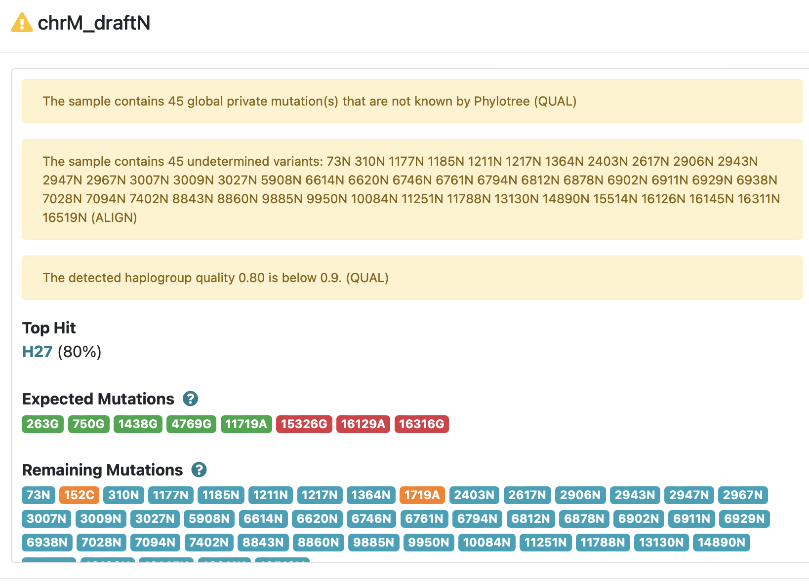
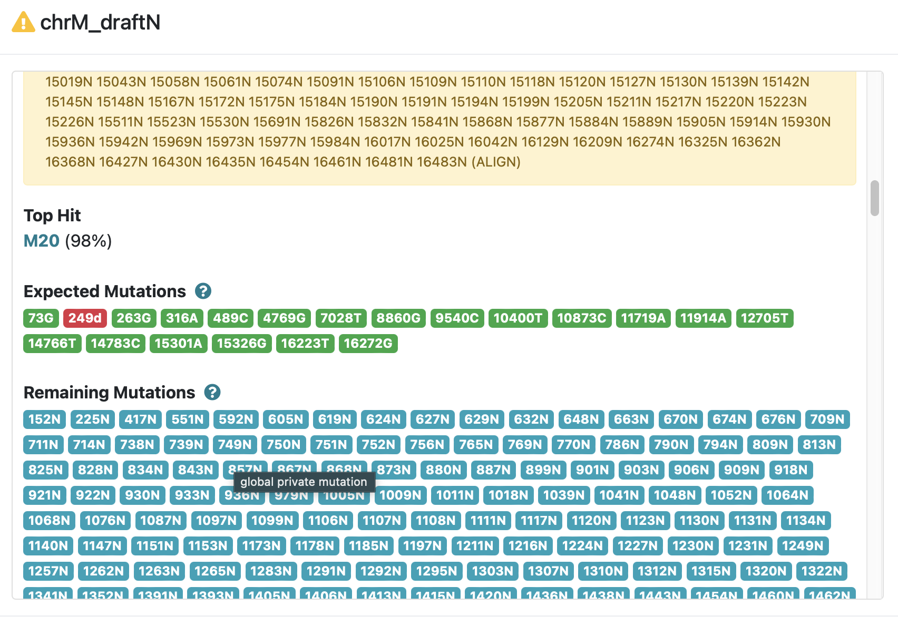
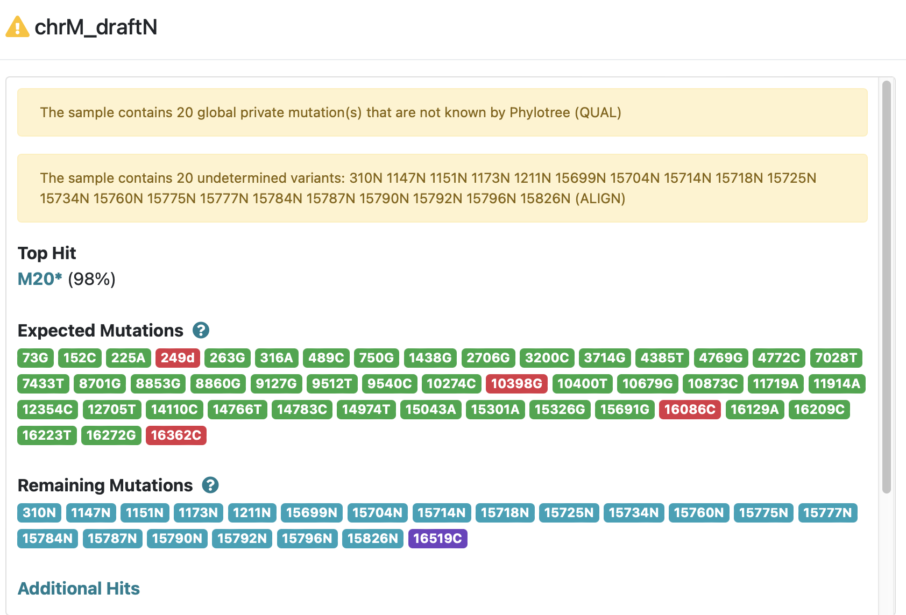

# Ancient DNA Analysis

## PCA Visualization
- [Interactive PCA Visualization](pca_visualization.html) - 3D visualization of PCA results for both Chachapoya and Nazca samples

## Nazca Analysis

### nf-core/eager Reports
- [hg38 momia1, momia3, momia5, momia6 nf-core/eager MultiQC Report](eager_hg38_ipn_eager_multiqc/multiqc_report.html#damageprofiler)
- [hg38 ancient0002, ancient0003, ancient0004 nf-core/eager MultiQC Report](eager_hg38_a234_eager_multiqc/multiqc_report.html#damageprofiler)

## Chachapoya Analysis

### Sample Information
- Sample NA50 was obtained from a dataset of pre-Columbian Chachapoyan and Chachapoya-Inca remains dating between 1000 and 1500 AD
- Location: Laguna de los Condores, northeastern Peru
- Material: Bone samples

### Sequence Data
- [Precapture NA50](https://trace.ncbi.nlm.nih.gov/Traces/?view=run_browser&acc=SRR1298755&display=metadata)
- [Postcapture NA50](https://trace.ncbi.nlm.nih.gov/Traces/?view=run_browser&acc=SRR1314601&display=metadata)

### nf-core/eager Reports
- [Precapture NA50 nf-core/eager MultiQC Report](eager_chachapoya_precapture_eager_multiqc/multiqc_report.html#damageprofiler) - Damage patterns for precapture data
- [Postcapture NA39-50 nf-core/eager MultiQC Report](eager_chachapoya_postcapture_eager_multiqc/multiqc_report.html#damageprofiler) - Damage patterns for postcapture data

## Mitochondrial DNA Analysis (rCRS)

### Consensus Sequences
#### ancient0002, ancient0003, ancient0004 Samples
- [ancient0002.fasta.gz](eager_rcrs_a234_eager_multiqc/consensus_sequence/ancient0002.fasta.gz)
- [ancient0003.fasta.gz](eager_rcrs_a234_eager_multiqc/consensus_sequence/ancient0003.fasta.gz)
- [ancient0004.fasta.gz](eager_rcrs_a234_eager_multiqc/consensus_sequence/ancient0004.fasta.gz)

#### momia1, momia3, momia5, momia6 Samples
- [m0mia6.fasta.gz](eager_rcrs_ipn_eager_multiqc/consensus_sequence/m0mia6.fasta.gz)
- [momia1.fasta.gz](eager_rcrs_ipn_eager_multiqc/consensus_sequence/momia1.fasta.gz)
- [momia3.fasta.gz](eager_rcrs_ipn_eager_multiqc/consensus_sequence/momia3.fasta.gz)
- [momia5.fasta.gz](eager_rcrs_ipn_eager_multiqc/consensus_sequence/momia5.fasta.gz)

### Haplogroup Analysis Results

| ancient0002 | ancient0003 | ancient0004 |
|-------------|-------------|-------------|
|  |  |  |
| [Download detailed results (ZIP)](haplogrep3_rCRS_nazca/ancient0002-haplogroups.zip) | [Download detailed results (ZIP)](haplogrep3_rCRS_nazca/ancient0003-haplogroups.zip) | [Download detailed results (ZIP)](haplogrep3_rCRS_nazca/ancient0004-haplogroups.zip) |
